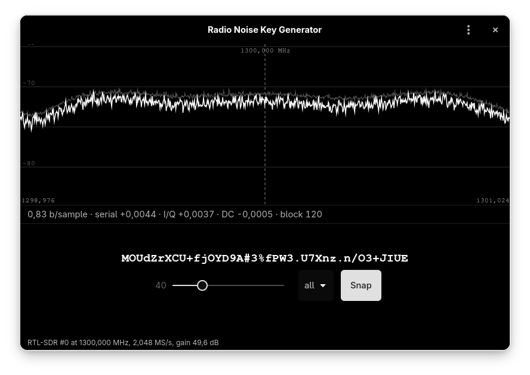

# Radio Noise Key Generator

**Passwords and keys of any length from RTL-SDR radio noise — with the
entropy measured, not assumed, and the kernel always mixed in.**

`radio-noise-key-generator` (`rnkg` on the command line) is a native
GTK4/libadwaita application and CLI tool for Linux, written in C11. Fifth
app of the OK1BR family, alongside
[sdr-for-linux](https://github.com/OK1BR/sdr-for-linux),
[skimmer-for-linux](https://github.com/OK1BR/skimmer-for-linux),
[log-for-linux](https://github.com/OK1BR/log-for-linux) and
[pass-for-linux](https://github.com/OK1BR/pass-for-linux).

> **Status: 0.x — young but audited.** Engine, CLI and the GTK window are
> done and verified live on an RTL-SDR Blog V4 (R828D). The whole
> generation path — estimator maths, health-test cutoffs, credit margin,
> rejection sampling, extractor construction — went through a full
> security review (2026-08-19) and the entropy estimates are cross-checked
> against the NIST reference tool on real captures; see
> [Verified, not assumed](#verified-not-assumed). Packaging (icon,
> .desktop, AUR) is the one milestone still open.



## Why

`/dev/urandom` is good. The interesting part is not replacing it — it is
being able to *see* where a key came from: which frequency, how much
min-entropy the samples actually carried, and which health tests passed
while they were collected.

So the radio never replaces the kernel here. Every derivation mixes in 64
bytes from `getrandom()`, unconditionally. **The output can never be weaker
than `getrandom()` alone**, whatever the dongle hands over — a dead antenna,
a driver returning constants, or someone deliberately transmitting into the
frequency you chose. The radio can only add: an attacker would have to
break both sources at once.

## What it measures

Raw RTL-SDR samples are not entropy. They carry a DC offset, a spur in the
middle of the passband, correlation between the I and Q branches, and
periodic artefacts from USB framing. So every block is tested before it is
credited with anything:

| Test | Source | Catches |
|---|---|---|
| Repetition Count | NIST SP 800-90B §4.4.1 | source stuck on one value |
| Adaptive Proportion | NIST SP 800-90B §4.4.2 | one value becoming dominant |
| Serial correlation | §4.5 developer-defined | tuned to a signal, not to noise |
| I/Q correlation | §4.5 developer-defined | structure in the sample stream |
| Most Common Value | NIST SP 800-90B §6.3.1 | how much min-entropy is really there |

Min-entropy, not Shannon entropy: Shannon answers "how well does this
compress", min-entropy answers "how well can an attacker guess the most
likely sample" — and only the second one bounds what a key is worth. Of the
min-entropy that MCV reports, half is credited; MCV assumes i.i.d. samples
and an RTL-SDR stream is not i.i.d.

A block that fails any test is not merely skipped: collection stops. A noise
source that failed a continuous health test may not go back to producing
output without a restart (SP 800-90B §4.3) — and the first healthy block
after tuning is startup evidence, never material.

## Verified, not assumed

- **Six test gates run on any machine, no dongle needed:** the health-test
  cutoffs reproduce the worked examples and Table 2 printed in SP 800-90B
  itself, the MCV bound pins the spec's own example (p_u = 0.6895 exactly),
  the detectors are fed synthetic streams (stuck, dominant-value,
  correlated, uniform), the FFT is pinned against a naive DFT, and the CLI
  snap path proves the startup block is discarded.
- **The credit margin is measured, not hoped for.** On real captures the
  NIST reference tool
  ([SP800-90B_EntropyAssessment](https://github.com/usnistgov/SP800-90B_EntropyAssessment))
  agrees with the built-in estimator, and the credited half sits below the
  full non-IID suite's floor on both operating points:

  | Capture (RTL-SDR Blog V4) | built-in MCV | NIST H_original | NIST full suite | credited |
  |---|---|---|---|---|
  | 1300 MHz, gain 49.6 dB | 0.83 b/sample | 0.803 | 0.662 | 0.42 |
  | 1300 MHz, gain 12.5 dB | 0.62 b/sample | 0.580 | 0.514 | 0.31 |

- **The rejection worked live:** tuned to an FM broadcast on purpose, the
  serial-correlation test kills the run; pulling the dongle mid-collection
  ends it cleanly through the error path, nothing generated.
- What was verified, what was measured and what remains open is written
  down bluntly in [`docs/STATUS.md`](docs/STATUS.md); the design contract
  is [`docs/SPEC.md`](docs/SPEC.md).

## Hardware

Any dongle librtlsdr can open should work — the entropy is measured per
block, never assumed from the hardware model. Developed and verified on the
[RTL-SDR Blog V4](https://www.rtl-sdr.com/V4/) (R828D tuner) from
[rtl-sdr.com](https://www.rtl-sdr.com/); the credit margin and the numbers
in the table above were measured on that dongle. On Arch the packaged
`extra/rtl-sdr` (2.0.2) runs the V4 out of the box, including the udev rule
that makes the device accessible without root or group changes. Numbers
from other tuners are welcome — see [CONTRIBUTING.md](CONTRIBUTING.md).

The noise collected at the default 1300 MHz is dominated by the receiver's
own thermal floor (see [`docs/SPEC.md`](docs/SPEC.md) §4) — the antenna's
job is only to let the spectrum strip show you the channel is really empty.

## Build

```
meson setup build
meson compile -C build
meson test -C build
```

Dependencies: `glib-2.0`, `libgcrypt`, GTK4 + `libadwaita` for the app, and
`librtlsdr` for the dongle. librtlsdr is optional — without it everything
still builds and the engine runs from captured sample files, which is how
the tests work.

## Use

The app shows a small spectrum strip (the visual check that your frequency
is really empty), one status line of live measurements, and a generation
panel where a fresh candidate — new extractor, that block's measured
credit, its own kernel seed — rotates with every healthy block. **Snap**
freezes one, **Copy** puts it on the clipboard and wipes it 45 seconds
later. Candidates shown before the snap are cryptographically independent
of the one you keep.

The CLI is the scriptable face of the same engine:

```
rnkg                          # 20 letters, from the dongle
rnkg -n 32 -a all             # 32 characters, letters + digits + punctuation
rnkg -k 32                    # 32 bytes of raw key material, as hex
rnkg -c 5                     # five passwords from one collection
rnkg --snap-after 3           # rotate candidates, keep the one current at 3 s
sleep 3 | rnkg --snap         # same, snapped by stdin closing — for scripts
rnkg --freq 1300 --gain 49.6  # pick the frequency and gain yourself
rnkg --file capture.bin -v    # replay a capture, show every measurement
rnkg --list                   # what dongles are present
```

Passwords go to stdout, one per line. Everything else — health tests,
entropy estimates, the source description — goes to stderr, so pipes work.
Length and alphabet default to whatever the app last saved, so the two
faces stay in step.

The default alphabet is letters only. A password made of letters survives
being typed on a keyboard whose layout is not the one it was generated on,
which is exactly the situation a LUKS passphrase prompt puts you in.

## Verifying the source yourself

`rnkg --file` also runs in the other direction: capture with `rtl_sdr`, then
feed the same bytes to the NIST reference tool and compare its min-entropy
estimate against what this program reports.

```
rtl_sdr -f 1300000000 -s 2048000 -g 49.6 -n 20000000 capture.bin
rnkg --file capture.bin -v
```

## Reporting a bug

Open an [issue](https://github.com/OK1BR/radio-noise-key-generator/issues)
with your dongle model and tuner, the exact command, and the stderr output
(`-v` prints every measurement). Measurements from hardware other than the
RTL-SDR Blog V4 are especially welcome — see
[CONTRIBUTING.md](CONTRIBUTING.md).

## License

[GPL-3.0-or-later](LICENSE).

## Author

Richard Fakenberg — **OK1BR** — [rifak.cz](https://rifak.cz)
